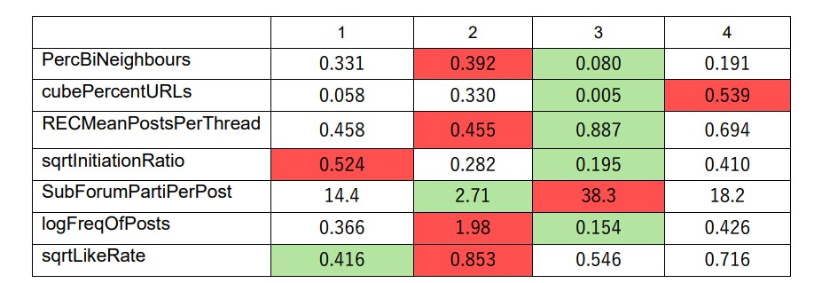

# Analysing social pltaform users using machine learning
Utilised supervised learning (Random Forest) and unsupervised learning (K-means) to analyse social platform users behaviour.

### Define the question
Help company understand their customers and provide insight to increase engagement. 

### Exploratory Data Analysis
Examines and visualizes data to understand its main characteristics, identify patterns, spot anomalies, and test hypotheses.

  
  

Data transformation (R square/log transformed) is applied after to handle skewness. A correlation matrix is implemented after determine the variables to check the
correlation between variables. 

 

standardizing or normalizing variables to ensure that each variable contributes equally to the clustering process.

### Unsupervised Model
K-means algorithm partitions a dataset into similar groups based on the distance between their centroids.
Using elbow method to find the optimum number of clusters. Based on EDA part k = 4 in the case.

 

silhouette score of 1 denotes that the data point is very compact within the cluster to which it belongs and far away from the other clusters. The worst value is -1. Values near 0 denote overlapping clusters. 

 

Generate insight by analysing clusters respectively.  
Cluster 1 - conversationalists  
Cluster 2 - active users   
Cluster 3 - quiet readers  
Cluster 4 - information provider  

 

### Supervised Model 
The random forest algorithm is an extension of the bagging method, it  relies on multiple decision trees and accepts the results of the predictions from each tree. Benefit includes resistant to overfitting, presenting estimates for variable importance, handle a wide variety of data types and missing values.  

Split data into training set and test set.  
Run random forest and tune the hyperparameters.  

 

Interpret the result from feature importance.  

 

Applying confusion matrix to check the classification result.  

 

### Analysis and conclusion 

making effort on quiet readers is suggested. More reward mechanisms and interactive communication activities should be strongly encouraged.

